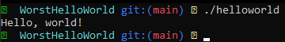

# Yes, it works!



## How to:
### Clone:
```sh
git clone https://github.com/lgoddijn/WorstHelloWorld.git
cd WorstHelloWorld
```

### Compile:

###### Hint: Make sure you have `make` and `clang` installed
```sh
$(which make) all
```

### Run:
```sh
./helloworld
```
